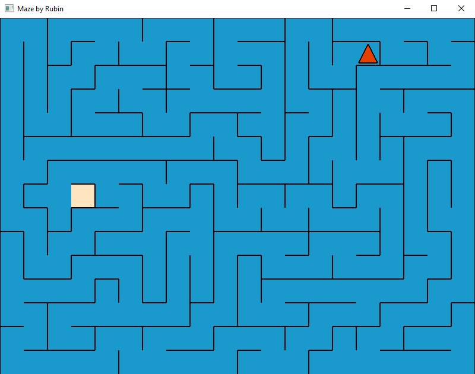
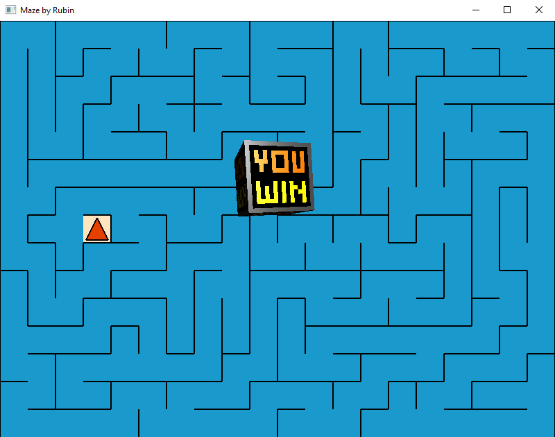

# RBT-Maze
A randomly-generated maze game made in OpenGL by Filipe Rubin.

It uses the Recursive Back-tracker algorithm to generate the maze. The player must use the arrow keys to move the red triangle to the goal. When the player reaches the goal, it pops up a 3D rotating box with the words "YOU WIN" in it. The textures are hardcoded so there's no image file required to play.

